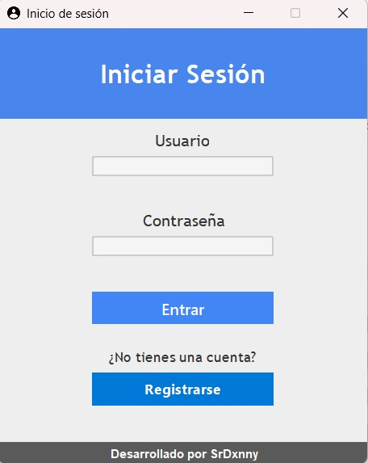
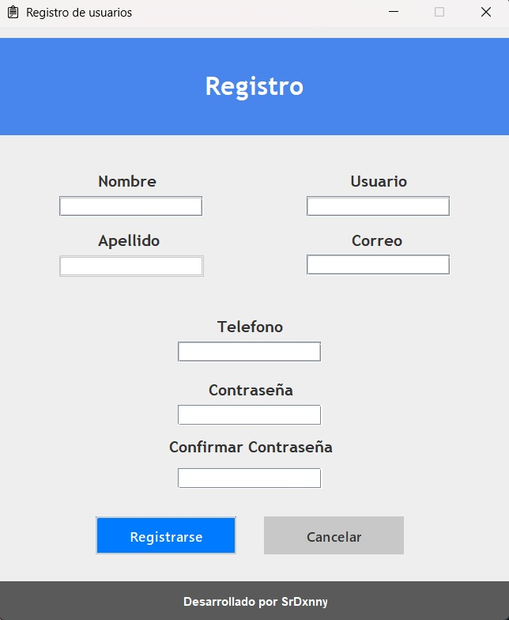
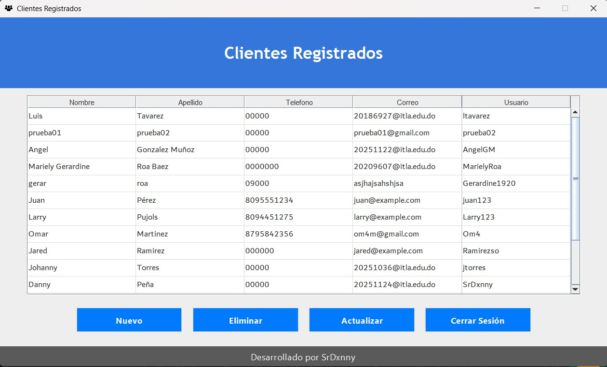

# Sistema de Registro, Login y Gestión de Usuarios (Java + MySQL)
### Proyecto desarrollado como parte de la asignatura de Programación 1 
**Autor:** Danny Peña (SrDxnny)

**Tecnologías:** Java · Swing · MySQL · Maven  

---

## Descripción del Proyecto
Este proyecto implementa un **sistema de gestión de usuarios**, que incluye:

**Registro de usuarios**  
**Inicio de sesión**  
**Actualización de datos**  
**Eliminación de registros**  
**Visualización de usuarios en tabla**  
**Validaciones y alertas**
**Interfaz gráfica hecha con Java Swing**  
**Conexión estable y segura a MySQL**  

El objetivo es ofrecer una solución funcional, visualmente agradable y bien estructurada.

---

## Tecnologías Utilizadas
| Tecnología | Uso |
|-----------|------|
| Java 17 | Lógica y GUI |
| Swing | Interfaz gráfica |
| MySQL | Base de datos |
| Maven | Gestión del proyecto y dependencias |
| NetBeans | IDE principal |
| GitHub | Control de versiones y despliegue |

---

## Comando de ejecución:
  mvn exec:java

## Capturas de Pantalla

### Pantalla de Inicio de Sesión  

### Registro de Usuario  

### Gestión de Usuarios  

